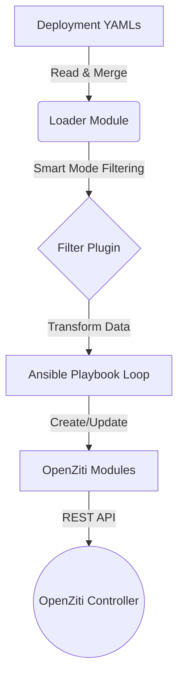

# Architecture Overview

The `netopsify.openziti` collection is designed to provide a declarative approach to managing OpenZiti resources using Ansible. It bridges the gap between high-level configuration files and the imperative OpenZiti REST API.

## Core Components

The architecture consists of four main layers:

1.  **Deployment Definitions (YAML)**: The source of truth. Structured files defining services, identities, and policies.
2.  **Loader Module (`openziti_loader`)**: Reads, merges, and filters definitions.
3.  **Transformation Filter (`ziti_transform`)**: Converts hierarchical data into flat lists actionable by Ansible.
4.  **Resource Modules**: Idempotent Ansible modules that interact with the OpenZiti Controller.

## Workflow

The automated workflow follows a linear pipeline:

### 1. Deployment Definitions
We use a "Service-Centric" file structure. A single YAML file (e.g., `web-service.yml`) can define:
*   The **Service** itself
*   **Configs** (Host/Intercept)
*   **Policies** (Dial/Bind/Router) necessary for that service

### 2. The Loader
The `openziti_loader` module scans the `deployments/` directory.
*   **Merging**: It combines all individual YAMLs into a single monolithic dictionary.
*   **Smart Mode**: It inspects git history to identify changed files. If `smart_mode=true`, it calculates which specific resources need validation/updates, optimizing execution time.

### 3. The Filter (`ziti_transform`)
The monolithic data structure is hierarchical. Ansible tasks, however, need flat lists to loop over.
The `ziti_transform` filter takes the deployment data and converts it into:
*   `openziti_identities`
*   `openziti_configs`
*   `openziti_services`
*   `openziti_service_policies`
*   `...`

### 4. The Modules
Finally, the `openziti_infra` role iterates over these lists and calls the specific modules (e.g., `openziti_service`).
Each module is **Idempotent**:
1.  **Check**: It queries the API to see if the resource exists.
2.  **Compare**: It compares the desired state (YAML) with the actual state (API).
3.  **Act**: It only sends a request (POST/PUT/DELETE) if a change is detected.
